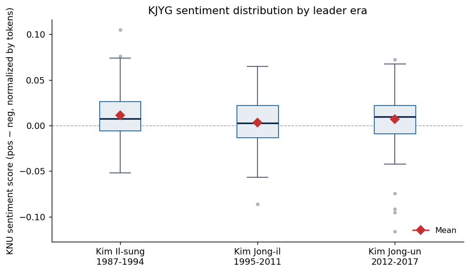
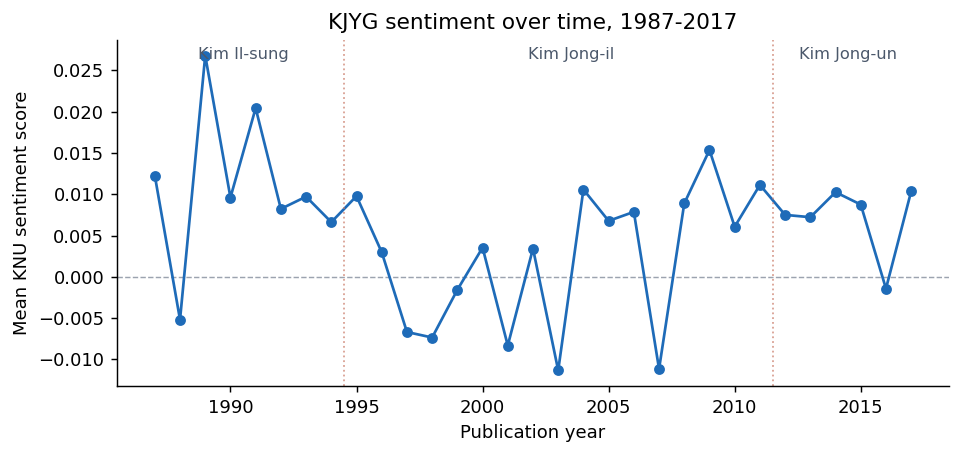
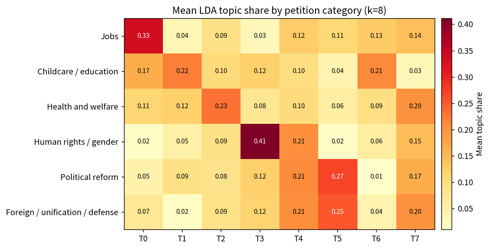
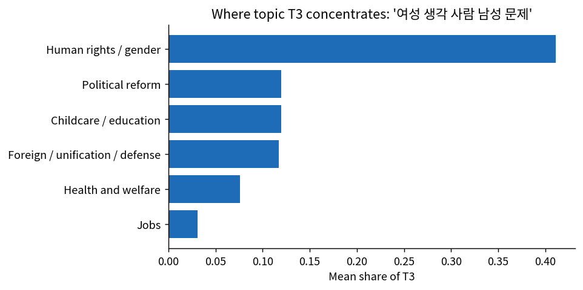
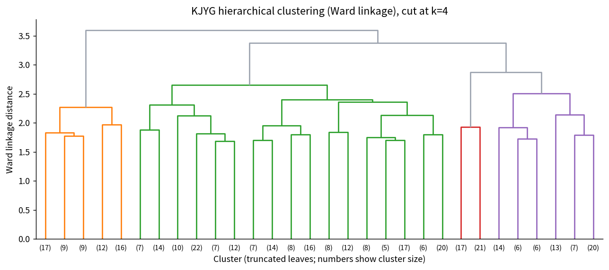
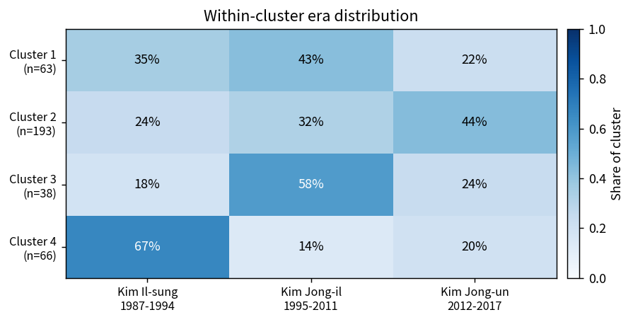

<h1>Final Assessment Exemplars</h1>

Three exemplars, one per Final Assessment task. Click a task to expand.

The figures below come from a Python pipeline that uses the same building blocks Orange does (Kiwi morphological tokenization, the KNU sentiment dictionary, scikit-learn LDA, hierarchical clustering with Ward linkage). Your Orange runs will produce close but slightly different numbers because random seeds and the exact preprocessing options differ. Read these as examples of the kind of answer the rubric rewards. An ideal answer states a clear research question, describes the method before showing results, cites a labeled figure from the prose, and ends with a short interpretation that explains the result.

Task A &middot; KJYG sentiment across leader eras

<h3>Research question</h3>

Is the sentiment of <em>Kyongje Yongu</em> articles measurably different across the three NK leader eras?

<h3>Method</h3>

Tokenize each of the 360 articles with Kiwi (keep nouns, verbs, adjectives). Match tokens against the KNU sentiment dictionary. Score each article as (positive hits minus negative hits) divided by the total token count. Aggregate by era and run pairwise t-tests.

<h3>Findings</h3>

<strong>Figure 1.</strong> Sentiment distribution by era. Boxes show the interquartile range, the black bar is the median, the red diamond is the mean.

<table class="summary-table">
<thead><tr><th>Era</th><th class="num">N</th><th class="num">Mean</th><th class="num">Median</th></tr></thead>
<tbody>
<tr><td>Kim Il-sung (1987–1994)</td><td class="num">120</td><td class="num">+0.011</td><td class="num">+0.008</td></tr>
<tr><td>Kim Jong-il (1995–2011)</td><td class="num">120</td><td class="num">+0.003</td><td class="num">+0.003</td></tr>
<tr><td>Kim Jong-un (2012–2017)</td><td class="num">120</td><td class="num">+0.007</td><td class="num">+0.010</td></tr>
</tbody>
</table>

The pattern is U-shaped. Kim Il-sung scores highest, Kim Jong-il lowest, Kim Jong-un sits between. The Il-sung vs. Jong-il gap is statistically distinguishable (Welch t = +2.35, p = 0.020); the other two pairs are not.

<strong>Figure 2.</strong> Mean sentiment by year. Vertical lines mark leader transitions.

The dip is in the late 1990s, around the Arduous March famine years. Kim Jong-un articles are higher on average than Kim Jong-il articles but still lower than the late Kim Il-sung baseline.

<h3>Interpretation</h3>

Era-level sentiment shifts track historical shocks more than they track regimes. The Kim Jong-il era looks more negative on average because the famine-era articles drag the mean down. By the 2010s the register has shifted toward "our-style economic management" language, which carries higher KNU positivity.

<h3>Limitations</h3>

KNU is contemporary South Korean, so some North Korean economic vocabulary will be missed. The absolute scores are small (3 to 11 polarity-bearing tokens per 1,000), so read these as relative comparisons across eras.

Task B &middot; Petition topics across categories

<h3>Research question</h3>

What latent topics run through the Cheong Wa Dae citizen petitions, and how cleanly do those topics map onto the six official policy categories?

<h3>Method</h3>

Tokenize each of the 360 petitions with Kiwi (keep nouns, verbs, adjectives). Fit LDA at k=8, deliberately more topics than the six official categories. Aggregate the document-topic distribution by <code>category</code> and take the mean topic share within each category.

<h3>Findings</h3>

<table class="compact-table">
<thead><tr><th>Topic</th><th>My label</th><th>Top words</th></tr></thead>
<tbody>
<tr><td class="id">T0</td><td class="label">Civil-service jobs and work hours</td><td class="words">공무원 · 의무 · 시간 · 일자리 · 근무</td></tr>
<tr><td class="id">T1</td><td class="label">Schools and childcare</td><td class="words">아이 · 교육 · 학교 · 유치원 · 선생</td></tr>
<tr><td class="id">T2</td><td class="label">Hospitals and medicine</td><td class="words">병원 · 환자 · 의료 · 치료 · 인권</td></tr>
<tr><td class="id">T3</td><td class="label">Gender and punishment</td><td class="words">여성 · 남성 · 사회 · 청소년 · 처벌</td></tr>
<tr><td class="id">T4</td><td class="label">Wrongdoing, victims, foreign actors</td><td class="words">사람 · 회사 · 일본 · 불법 · 피해자</td></tr>
<tr><td class="id">T5</td><td class="label">Inter-Korean and presidential politics</td><td class="words">국민 · 북한 · 한국 · 대통령 · 정치</td></tr>
<tr><td class="id">T6</td><td class="label">Schoolwork and teachers</td><td class="words">학생 · 교사 · 학교 · 채용 · 수업</td></tr>
<tr><td class="id">T7</td><td class="label">Pensions and the state</td><td class="words">국민 · 국가 · 연금 · 청원 · 대통령</td></tr>
</tbody>
</table>

<strong>Figure 1.</strong> Mean LDA topic share by petition category. Darker cells: topic words concentrate there.

Five of the eight topics align tightly with one official category. T0 (civil-service jobs) concentrates in Jobs at 0.33. T2 (hospitals) peaks in Health and welfare at 0.23. T3 (gender) is sharpest of all, concentrating at 0.41 in Human rights / gender equality.

Two topics cross-cut. T5 (inter-Korean and presidential politics) sits at 0.27 in Political reform and 0.25 in Foreign / unification / defense. The shared vocabulary (대통령, 정치, 북한) is common to petitions in both categories.

<strong>Figure 2.</strong> Where T3 concentrates. Its mean share in Human rights / gender equality is three to four times the share in any other category.

<h3>Interpretation</h3>

LDA finds most of the categorical structure the platform's editors put in place. The cross-cutting topics are the more interesting result: petitions about the executive branch and petitions about North-South relations use overlapping vocabulary, even when their official category differs.

<h3>Limitations</h3>

Topic count is a choice. At k=6 the topics collapse toward the official categories. At k=12 several fragment. Topic labels are also interpretive: "gender and punishment" is one defensible reading of T3.

Task C &middot; Clustering KJYG into four registers

<h3>Research question</h3>

If we cluster the 360 KJYG articles by the words they use, what makes each cluster distinctive in vocabulary and tone? Do the clusters track the leader eras?

<h3>Method</h3>

Tokenize each article with Kiwi (keep nouns, verbs, adjectives). Compute TF-IDF. Run hierarchical clustering with Ward linkage. Cut at k=4. Characterize each cluster by its top distinctive terms (mean TF-IDF inside the cluster minus mean outside). Pull in per-document KNU sentiment from Task A so each cluster has a tone reading.

<h3>Findings</h3>

<strong>Figure 1.</strong> Ward-linkage dendrogram (truncated to 30 leaves). Cutting at k=4 gives the four colored branches.

<table class="compact-table">
<thead><tr><th>Cluster</th><th>My label</th><th>Top distinctive terms</th><th class="num">N</th><th class="num">Sent.</th></tr></thead>
<tbody>
<tr><td class="id">C1</td><td class="label">Anti-imperialist polemic</td><td class="words">자본주의 · 미국 · 자본 · 독점 · 제국주의 · 위기 · 시장 · 자본가</td><td class="num">63</td><td class="num">−0.005</td></tr>
<tr><td class="id">C2</td><td class="label">Technical / managerial economics</td><td class="words">제품 · 계산 · 정보 · 효과 · 지출 · 수입 · 지표 · 경영</td><td class="num">193</td><td class="num">+0.008</td></tr>
<tr><td class="id">C3</td><td class="label">Songun and heavy industry</td><td class="words">국방 · 혁명 · 선군 · 조국 · 공업 · 중공업 · 자립 · 군사</td><td class="num">38</td><td class="num">+0.013</td></tr>
<tr><td class="id">C4</td><td class="label">Mass-line collectivism</td><td class="words">주인 · 대중 · 지도 · 사상 · 집단 · 집단주의 · 의식 · 공산주의</td><td class="num">66</td><td class="num">+0.013</td></tr>
</tbody>
</table>

Cluster 1 is the only cluster with negative mean sentiment. The vocabulary explains why: 위기 (crisis), 제국주의 (imperialism), 미제 (US imperialism), 독점 (monopoly). The negative scoring is about capitalism and the United States, not about North Korea itself.

<strong>Figure 2.</strong> Within-cluster era distribution. Two of the four clusters skew strongly to one era.

Cluster 4 (mass-line collectivism) is 67% Kim Il-sung. Cluster 3 (Songun) is 58% Kim Jong-il, exactly when Songun was the operative state policy. Cluster 2 (technical economics, the largest at n=193) skews plurality Kim Jong-un at 44%, consistent with the post-2012 "our-style economic management" rhetoric. Cluster 1 (anti-imperialist polemic) is roughly even across all three eras.

<h3>Interpretation</h3>

<em>Kyongje Yongu</em> uses at least four distinct registers. Two are era-specific; two are present in every era. The Task A finding that Kim Jong-il-era articles are slightly more negative on average is partly explained here: the negative scoring is concentrated in cluster 1, which is roughly the same size in every era. What changes between eras is the mix of the other three registers.

<h3>Limitations</h3>

Cluster sizes are uneven. Cluster 2 contains 54% of all articles. Trying complete linkage or k-means at the same k would help check whether the imbalance is real or an artifact of the chosen distance.

<strong>The pattern repeats across all three tasks.</strong> A clear research question, the method described before results, a labeled figure cited from the prose, a short interpretation that explains the result, and an honest note on what the method misses. That is the answer at the top of the rubric.

